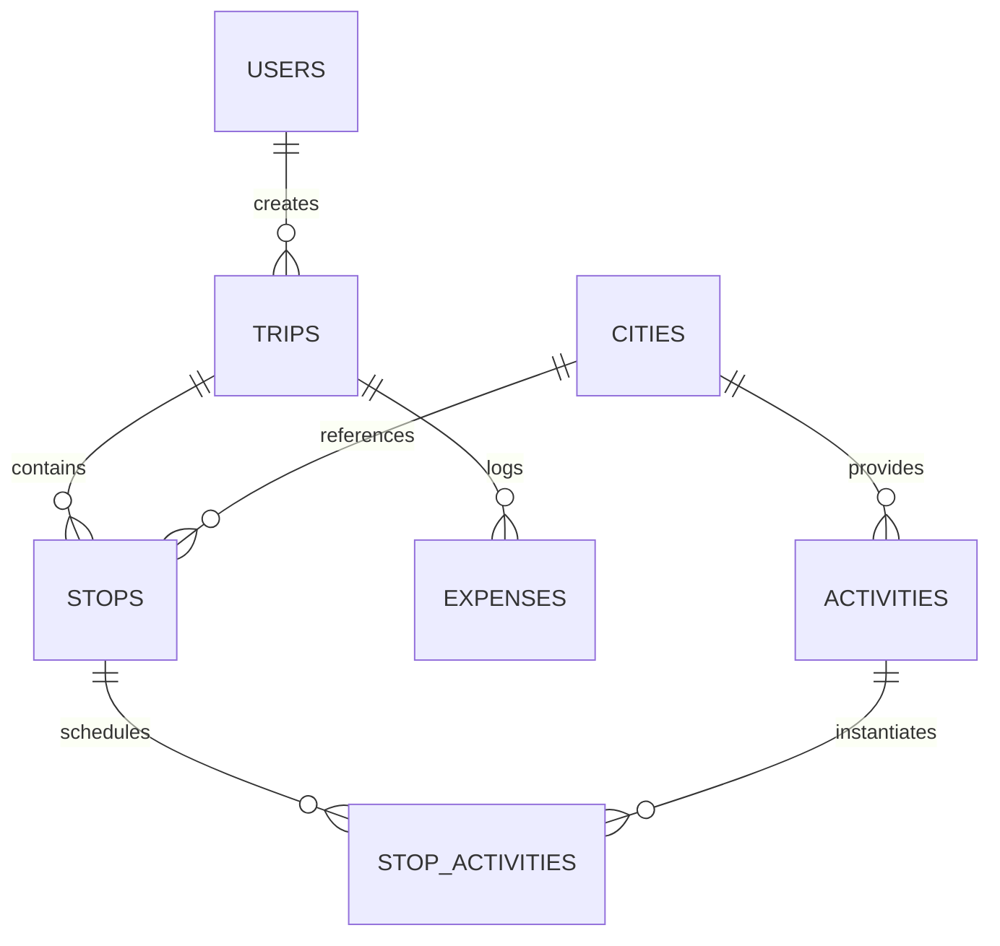

# 🌐 GlobeTrotter AI

**GlobeTrotter AI** is an intelligent multi-city travel planning and budget optimization platform built on a Dual-Core Architecture: a deterministic engine for financial math and scheduling, paired with a generative AI layer (Google Gemini 3.5 Flash Lite) for creative itinerary synthesis and conversational assistance.

Unlike generic chatbot wrappers, GlobeTrotter AI eliminates AI hallucination in the two places it matters most — money and logistics — while still giving users a natural-language, AI-powered planning experience.

---

## Table of Contents

- [Overview](#overview)
- [Tech Stack](#tech-stack)
- [Database Schema](#database-schema)
- [Features](#features)
- [File-to-Feature Map](#file-to-feature-map)
- [Why GlobeTrotter AI](#why-globetrotter-ai)

---

## Overview

GlobeTrotter AI solves two core failure points of modern AI travel tools:

1. **Unreliable AI hallucinations** — fabricated cities, activities, or budget numbers.
2. **Complex multi-city schedule coordination** — conflicting timelines, unassigned activities, and pacing issues.

**Dual-Core Architecture:**
- **Deterministic Core** — handles financial math, expense tracking, itinerary scheduling, catalog lookups, and multi-factor destination scoring with zero floating-point errors or numerical hallucinations.
- **Generative AI Layer (Gemini 3.5 Flash Lite)** — synthesizes creative itineraries from natural language prompts, powers a conversational travel copilot, runs multi-goal itinerary optimization, and translates budget data into plain-English advice.

---

## Tech Stack

| Layer | Technologies | Purpose |
|---|---|---|
| Frontend Framework | React 19, TypeScript, Vite 8 | High-performance SPA with strict type safety |
| Styling & Design | Tailwind CSS 4, Radix UI, Lucide Icons | Responsive UI with glassmorphism and Stitch design tokens |
| State & Data Fetching | TanStack Query v5 | Server state, cache invalidation, optimistic updates |
| Data Visualization | Recharts 3.10 | Donut charts, daily cost bar charts, pacing reference lines |
| Forms & Validation | React Hook Form, Zod v3 | Client-side and API payload validation |
| Backend & Database | Supabase, PostgreSQL, RLS | Relational persistence, auth, edge execution |
| Generative AI | Google Gemini API (`gemini-3.5-flash-lite`), `@google/genai` | Copilot, trip generator, itinerary optimizer |
| Notifications | Sonner | Real-time toast feedback |

---

## Database Schema

7 relational tables in PostgreSQL (Supabase):



### Tables

**`users` / `profiles`**
`id (UUID, PK)`, `email`, `full_name`, `avatar_url`, `preferred_currency`, `home_city`

**`trips`**
`id (UUID, PK)`, `user_id (FK)`, `title`, `description`, `start_date`, `end_date`, `target_budget`, `currency`, `status`, `is_public`, `share_slug`, `cover_image_url`

**`cities`**
`id (UUID, PK)`, `name`, `country`, `lat`, `lng`, `cost_index`, `image_url`, `description`, `popular_categories`

**`stops`**
`id (UUID, PK)`, `trip_id (FK)`, `city_id (FK)`, `stop_order`, `arrival_date`, `departure_date`

**`activities`**
`id (UUID, PK)`, `city_id (FK)`, `title`, `description`, `category`, `estimated_cost`, `duration_hours`, `image_url`

**`stop_activities`**
`id (UUID, PK)`, `stop_id (FK)`, `activity_id (FK, nullable)`, `day_number`, `scheduled_time`, `cost`, `notes`, `is_completed`

**`expenses`**
`id (UUID, PK)`, `trip_id (FK)`, `category`, `amount`, `date`, `description`, `receipt_url`

---

## Features

### 1. Landing Page & Global Navigation
High-impact hero section, live interactive itinerary/budget preview, 8-feature capability grid, showcase expedition cards with live match scores and currency conversion, AI Trip Generator entry point.

### 2. ✨ Generative AI Trip Generator
Accepts free-form prompts with constraints (budget, duration, style, interests). Prompts Gemini with catalog constraints to prevent fabricated cities/activities, validates output against Zod schemas, maps generated entities to real DB IDs via a catalog matcher, and creates the trip + stops + activities atomically.

### 3. Itinerary Builder & Schedule Breakdown
Day-by-day chronological view derived from trip dates and stops. Activity scheduling from catalog or custom entries. Optimistic TanStack Query cache updates. Completion tracking. Conflict/validation detection for schedule gaps.

### 4. Interactive Calendar & Timeline Grid
Horizontal day-picker with city tags and activity badges. Activities organized into 4 pacing blocks: Morning (06:00–12:00), Afternoon (12:00–17:00), Evening (17:00–21:00), Night (21:00–06:00). Time-overlap conflict detection and a reschedule modal.

### 5. Deterministic Budget Engine & Visualizations
Pure deterministic arithmetic for sums, deficits, and allocations. Tracks Planned Cost, Actual Cost, and Effective Cost (`max(planned, actual)`). Recharts donut chart across 5 categories and daily cost bar chart against target pacing. Over-budget warning banner with exact deficit.

### 6. ✨ Smart Budget Assistant (Zero-Hallucination)
Identifies the most expensive category and high-cost activities on congested days, searches the catalog for cheaper alternatives, computes exact savings, offers 1-click apply, and uses Gemini only to explain the math in plain English.

### 7. ✨ AI Travel Copilot & Multi-Goal Itinerary Optimizer
Live multi-turn chat (Gemini 3.5 Flash Lite, temperature 0.75) with full trip context injection (dates, stops, schedule, budget). Rich markdown rendering. Optimizer analyzes 4 goals: Cost Reduction, Pacing & Fatigue Reduction, Cultural Immersion, Hidden Gems Discovery.

### 8. AI Destination Matchmaker
4-factor weighted deterministic scoring:

```
Score = (W_budget × S_budget) + (W_interest × S_interest) + (W_style × S_style) + (W_season × S_season)
```

Weights: Budget Alignment 35%, Interest Overlap 30%, Style Compatibility 20%, Seasonality 15%. Displays 0–100% match scores with an AI-generated reasoning accordion.

### 9. Public Trip Sharing & Deep Clone Engine
Toggleable public sharing with a slug URL, read-only public trip view, and 1-click deep clone into the authenticated user's workspace in a single transaction.

### 10. Global Multi-Currency Conversion Engine
Supports INR, USD, EUR, GBP, JPY, AED, AUD, CAD. Synchronized via React Context; recalculates and reformats all prices app-wide in real time.

### 11. Interactive Notification Center
Badge counter on navbar bell. Categorized alerts: Budget Alerts, AI Suggestions, Schedule Reminders. Mark as read / mark all read / clear all.

---

## File-to-Feature Map

| File | Responsibility |
|---|---|
| `src/services/ai/client.ts` | Unified Gemini 3.5 API invoker with model fallback |
| `src/services/ai/copilot.ts` | Multi-turn travel copilot session handler |
| `src/services/ai/tripGenerator.ts` | NL prompt → structured multi-city itinerary |
| `src/services/ai/optimizer.ts` | Multi-goal itinerary optimization engine |
| `src/components/ai/AITravelCopilotDrawer.tsx` | Slide-out live chat drawer |
| `src/components/ai/FormattedMarkdown.tsx` | Zero-dependency markdown parser/renderer |
| `src/features/budget/engine/budgetEngine.ts` | Deterministic budget/deficit/category math |
| `src/features/budget/engine/assistantEngine.ts` | Rule-based substitution & savings calculator |
| `src/features/itinerary/components/ItineraryBuilder.tsx` | Day-by-day, stops manager, timeline container |
| `src/features/activities/components/ActivityScheduleModal.tsx` | Activity discovery and scheduling |
| `src/features/recommendations/engine/scoringEngine.ts` | 4-factor destination recommendation math |
| `src/features/sharing/services/cloneTripService.ts` | Deep clone engine for public trips |
| `src/context/CurrencyContext.tsx` | Multi-currency provider and formatter |
| `src/components/layout/NotificationDropdown.tsx` | Notification center dropdown |

---

## Why GlobeTrotter AI

**Why not a raw LLM?**
Raw LLMs hallucinate non-existent locations and fail at financial arithmetic. GlobeTrotter AI decouples math and database lookups into a deterministic engine, reserving Gemini for generative reasoning only.

**Offline & API resilience**
If there's no internet or an invalid API key, the app gracefully degrades to deterministic local synthesis without crashing.

**Database integrity**
Strictly typed schemas with foreign keys ensure that deleting a stop or trip cascades cleanup to associated activities and expenses.
